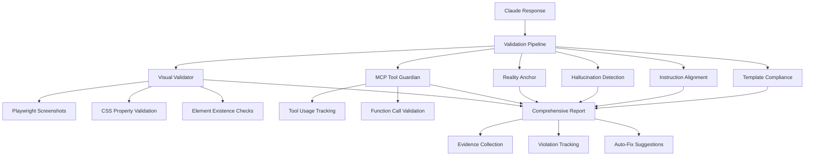

# 🐕‍🦺 Claude Guardrail System

> **Stop babysitting AI - Make Claude accountable for its work**

<div align="center">



[](LICENSE)
[](https://www.python.org/downloads/)
[](https://badge.fury.io/py/claude-guardrail-system)
[](https://github.com/yourusername/claude-guardrail-system/actions)

**Comprehensive validation and accountability framework that ensures Claude actually delivers what it promises**

[Installation](#installation) • [Quick Start](#quick-start) • [Features](#features) • [Documentation](docs/) • [Examples](examples/)

</div>

---

## 🚨 The Problem

**Claude (and other AI assistants) frequently:**
- ❌ **Hallucinate implementations** - Claims to build features that don't exist
- ❌ **Make vague promises** - "I'll make it beautiful" → minimal changes
- ❌ **Ignore templates** - Creates generic solutions instead of using your examples
- ❌ **Fake tool usage** - Claims to use tools without actually calling them
- ❌ **Break momentum** - Constant verification kills development flow

## ✅ The Solution

**Claude Guardrail System provides:**
- 🔍 **Multi-layer validation** - Template compliance, hallucination detection, reality anchoring
- 📸 **Visual proof collection** - Screenshots and evidence for styling claims
- 🔧 **MCP tool validation** - Ensures claimed tools are actually used
- ⚡ **Real-time monitoring** - Catches issues during response generation
- 🤖 **Auto-fix capabilities** - Maintains development momentum
- 📊 **Comprehensive reporting** - Detailed evidence and violation tracking

---

## 🚀 Quick Start

### Installation

**Install from GitHub (Current Method):**
```bash
# Install directly from GitHub
pip install git+https://github.com/Probioform/claude-guardrail-system.git

# Setup configuration
python3 -m claude_guardrail.cli.main setup

# For visual validation (optional)
npm install playwright
npx playwright install
```

**Install from PyPI (Coming Soon):**
```bash
# Will be available soon
pip install claude-guardrail-system
claude-guard setup
```

### Basic Usage

```bash
# Validate Claude's response
claude-guard validate claude_response.txt --context context.json

# Include visual validation
claude-guard validate claude_response.txt --context context.json --visual --dev-server http://localhost:3000

# Check MCP tool usage
claude-guard check-mcp claude_response.txt "Make my blog beautiful"

# Enhance prompts before sending to Claude
claude-guard prompt "make my blog beautiful" --enhance --template blog.html
```

### Python API

```python
from claude_guardrail import ValidationPipeline, MCPToolGuardian

# Validate Claude's response
pipeline = ValidationPipeline()
result = pipeline.validate(claude_response, {
    "user_request": "Make blog beautiful using my template",
    "project_root": ".",
    "template_path": "template.html"
})

print(pipeline.generate_feedback(result))

# Check tool usage
mcp_guardian = MCPToolGuardian()
tool_result = mcp_guardian.validate_tool_usage(claude_response, user_request)
```

---

## 🎯 Core Features

### 1. **Template Compliance Validation**
Ensures Claude actually uses your provided templates instead of creating generic alternatives.

```python
# ❌ Before: Claude ignores your beautiful template
# ✅ After: Forces explicit template reference and usage
```

### 2. **Hallucination Detection**
Catches implementation claims without corresponding code or evidence.

```python
# ❌ Detects: "I created a beautiful component..." (no code shown)
# ✅ Requires: Actual code blocks or function calls
```

### 3. **Visual Proof Collection**
Uses Playwright to capture screenshots and validate styling claims.

```python
# ❌ Before: "I made it beautiful" (no verification)
# ✅ After: Screenshot evidence + CSS property validation
```

### 4. **MCP Tool Guardian**
Validates that claimed tool usage matches actual tool execution.

```python
# ❌ Detects: "I'll search for..." (no web_search function call)
# ✅ Requires: Actual MCP tool usage
```

### 5. **Real-Time Monitoring**
Monitors Claude's response generation and provides immediate feedback.

```bash
# Watch for issues as Claude responds
claude-guard monitor --watch
```

---

## 📸 Visual Validation Examples

### Before Guardrail System
```
Claude: "I've made the blog beautiful with glassmorphic cards and gradients"
Developer: *checks* → Just changed background-color: #fff to #f0f0f0
Result: ❌ Wasted time, broken promises
```

### After Guardrail System
```
🔍 VISUAL VALIDATION RESULTS:
❌ Glassmorphism Check: backdrop-filter property not found
❌ Gradient Check: linear-gradient not detected  
❌ Card Component: .glassmorphic-card selector not found
📸 Evidence: screenshot_20241205_143022.png

💡 SUGGESTIONS:
- Add backdrop-filter: blur(10px) to card elements
- Implement linear-gradient background
- Create .glassmorphic-card CSS class
```

---

## 🛠️ Configuration

Create `~/.claude-guardrail/config.yaml`:

```yaml
validation:
  layers:
    template_compliance: 
      enabled: true
      blocking: true
    hallucination_detection:
      enabled: true
      blocking: true
    reality_anchor:
      enabled: true
      strict_mode: true

visual_validation:
  enabled: true
  require_screenshots: true
  dev_server_url: "http://localhost:3000"

mcp_integration:
  require_visual_proof: true
  validate_tool_claims: true
  auto_screenshot: true
```

---

## 📊 Validation Layers

| Layer | Purpose | Blocking | Evidence |
|-------|---------|----------|----------|
| **Template Compliance** | Ensures template usage | ✅ | Template references |
| **Instruction Alignment** | Word-by-word instruction checking | ✅ | Keyword analysis |
| **Hallucination Detection** | Catches fake implementations | ✅ | Code/tool evidence |
| **Reality Anchor** | Grounds in actual project files | ❌ | File system validation |
| **MCP Tool Validation** | Validates tool usage claims | ✅ | Function call tracking |
| **Visual Validation** | Screenshot evidence collection | ❌ | Browser automation |

---

## 🎮 Demo

Try the demo to see the guardrail system in action:

```bash
# Generate demo files
claude-guard demo

# Run validation on demo
claude-guard validate demo/claude_response.txt --context demo/context.json --visual
```

---

## 🏗️ Architecture



---

## 📁 Project Structure

```
claude-guardrail-system/
├── src/claude_guardrail/          # Main source code
│   ├── validation/                # Validation layers
│   ├── mcp/                      # MCP tool integration
│   ├── visual/                   # Visual validation
│   └── cli/                      # Command-line interface
├── tests/                        # Comprehensive test suite
├── docs/                         # Documentation
├── examples/                     # Usage examples
├── assets/logos/                 # Animated logos
├── config/                       # Configuration templates
└── scripts/                      # Deployment scripts
```

---

## 🤝 Contributing

We welcome contributions! The guardrail system was born from real frustration with AI accountability.

### Development Setup
```bash
git clone https://github.com/yourusername/claude-guardrail-system
cd claude-guardrail-system
pip install -e ".[dev]"
pre-commit install
pytest
```

### Areas for Improvement
- [ ] Support for more AI models (GPT-4, Gemini, etc.)
- [ ] Advanced template matching algorithms
- [ ] IDE integrations (VS Code, JetBrains)
- [ ] Team collaboration features
- [ ] More sophisticated visual validation

---

## 📜 License

MIT License - Use this to keep any AI accountable!

---

## 🙏 Acknowledgments

Born from the real frustration of [@olemagnuskikut](https://github.com/olemagnuskikut) dealing with Claude's promises vs reality.

> **"No more AI babysitting - just accountability!"**

---

<div align="center">

⭐ **Star this repo** if you're tired of AI hallucinations!

🐕‍🦺 **Issues?** The guard dog will catch them → [Report bugs](https://github.com/yourusername/claude-guardrail-system/issues)

📖 **Documentation** → [Full Docs](docs/) | [API Reference](docs/api/) | [Examples](examples/)

</div>